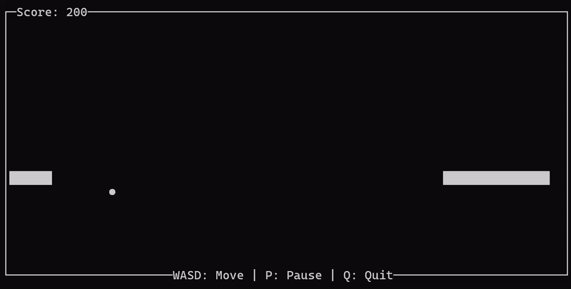
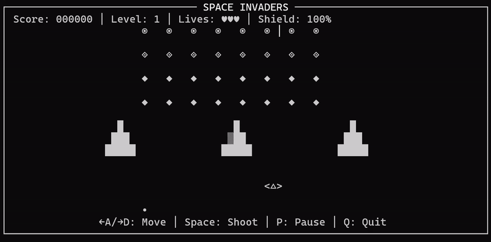

# Tamagotcha!
Tamagotcha is an open-source CLI game simulating the portable tamagotchi game popular in the 90s. This version features save states, 4 animation-cycles and 2 playable retro games renditioned on CLI.
## Usage

This project runs in a terminal using a `curses`-based interface.

### Requirements

#### Unix-based systems (Linux / macOS)

On Unix-based systems, `curses` is available by default and no additional packages are required.

```bash
python3 --version
python3 main.py
```
- A terminal window of at least **80×15**
- Keyboard input enabled

> **Windows users:** Python 3.13+ is not supported due to `curses` limitations. It is advised to use a python environment: `py -3.11 -m venv venv`. Then install `pip install -r requirements.txt`. Be mindful that the project has **NOT** been developed for windows. As such, bugs can occur that may or may not be fixed.

---

Upon running, insert the desired pet's name, may it be already existing or a new one. 


You'll be greeted by your pet, demonstrating a fiery passion towards his owner! On the right a working atomic set of the pet's attributes are shown.

**HAVE FUN!**

---

## Working Commands:
-   **Fire**: Plays the spewing-fire animation. Has no functionality;
-   **Sleep**: The pet recovers fatigue and gets less sleepy;
-   **Snake**: A CLI version of the popular Snake game
-   **Space**: A simplified CLI version of the popular Space Invaders game
-   **Kill**: Kills the pet and deletes the save file
-   **Idle**: Returns the pet into the idle animation
-   **Exit/Quit**: Exit the game 

The game is saved after every command's completion.
---
# Gameplay
The goal of the game is to keep your pet **ALIVE** as long as possible while making the pet grow by accumulating experience.

The user can play two retro *games* to increase its pets' experience. 

Snake
---



Space Invaders
---

---

#### Playing games fatigues the pet. When fatigue reaches 0, the player dies, destroying the save file FOREVER.
---
To make the pet rest, the player can use the **SLEEP** command, to make the fatigue and sleepiness recover over time.
---

##  Troubleshooting

### Terminal Too Small
Resize your terminal to at least 80×15 characters.

### Windows Cursor Issues
Some Windows terminals may have display issues. Try  WSL for better compatibility.

### Some characters bug out
Be sure to have UTF-8 encoding support for proper character display

---

### Contributions are welcome. Feel free to:
 - Report Bugs
 - Submit Pull Requests
 - Add New animations

